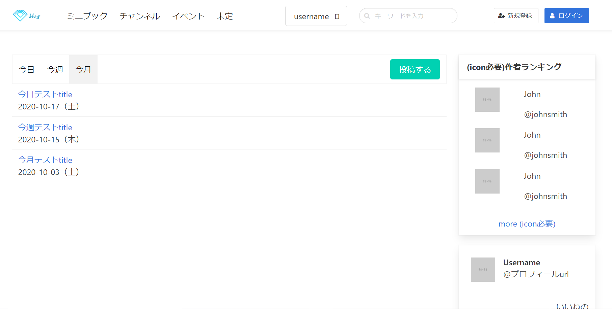

# minibook shop


## Project setup
```
yarn install
```

### Compiles and hot-reloads for development
```
yarn serve
```

### Compiles and minifies for production
```
yarn build
```

### Run your unit tests
```
yarn test:unit
```


### UIプラグインbulmaのドキュメント

https://bulma.io/documentation/ en

http://lqzh.me/bulma-docs-cn/documentation/columns/basics/ cn

### Suspenseのドキュメント
```
https://qiita.com/ryo2132/items/7225d60768a15dabfb9f
```

### 現在使用するiconドキュメント

```
https://fontawesome.com/icons/home
```

## ディレクトリ構成

```

```